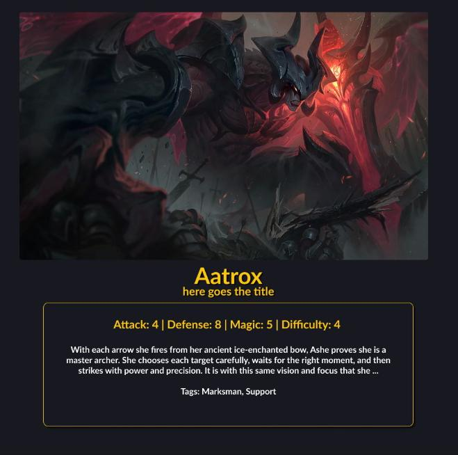

# League Of Legends - Chose Your Champion


> Na aplicação Chose Your Champion, você pode analisar dados como: ataque, defesa, magia e dificuldade de cada campeão do jogo League of Legends, tornando mais fácil a escolha do campeão ideal pra sua jogabilidade.

### Ajustes e melhorias

Esse projeto foi criado durante o bootcamp da Laboratória, com foco em manipulação de dados estruturados (arrays e objetos) e métodos de javascript (filter, map, reduce etc).

- [ ] Tradução dos textos para diversos idiomas
- [ ] Implementação de guia de jogabilidade

#### Ferramentas Utilizadas

- [Git](https://git-scm.com/)
- [GitHub](https://github.com/)
- [GitHub Pages](https://pages.github.com/)
- [Node.js](https://nodejs.org/)
- [Jest](https://jestjs.io/)
- [Google Charts](https://developers.google.com/chart/)
- [Figma](https://figma.com/)

## 1. Usuários

#### - Quem são os usuários principais do produto?
  Jogadores e futuros jogadores de League of Legends que desejam aprofundar e entender melhor os campeões.

#### - Quais são os objetivos dos usuários com relação ao produto?
  Definir quais campeões eles se identificam mais pra poder jogar.

#### - Quais são os dados mais relevantes que querem ver na interface e por quê?
  Cards com foto dos campeões e dados como categoria (assassino, tanque, suporte etc) e dados de HP, força etc.

#### - Quando utilizam ou utilizariam o produto?
  Quando desejarem escolher o melhor campeão pra jogar.


## 2. Histórias do Usuário

#### **1ª História do Usuário**

Eu, como visitante, quero visualizar todos os campeões do LOL em cards e ao clicar em um card, quero ser direcionado a uma página/pop-up com as informações do campeão específico.

**Critérios de Aceitação**
- Visualizar os campeões em cards
- Ao clicar no card receber as informações completas do campeão selecionado
- Botão de voltar/fechar pop-up

**Definição de Pronto**
- Fez a página de acordo com o protótipo
- O código ta no repositório (com branches, commits etc)
- Tem testes e passa nos testes com 70% de aprovação no minimo
- Testes de usuário

    

#### **2ª História do Usuário**

Depois de receber as informações do campeão selecionado, quero buscar um campeão por nome e filtrar por categoria

**Critérios de Aceitação**
- Buscar por nome (drop down)
- Filtro por categoria (botões do nav)

**Definição de Pronto**
- Fez a página de acordo com o protótipo
- O código ta no repositório (com branches, commits etc)
- Tem testes e passa nos testes com 70% de aprovação no minimo
- Testes de usuário

    

####  **3ª História do Usuário**

Quero ordenar por dificuldade e fazer um calculo agregado

**Critérios de Aceitação**
- Filtro de ordenação por dificuldade
- Campo pra calculo agregado?

**Definição de Pronto**
- Fez a página de acordo com o protótipo
- O código ta no repositório (com branches, commits etc)
- Tem testes e passa nos testes com 70% de aprovação no minimo
- Testes de usuário


## 3. Protótipos de Baixa Fidelidade


## 4. Protótipos de Alta Qualidade




## 5. Problemas Detectados nos Testes de Usabilidade


## 6. Usando Chose Your Champion

Para usar Chose Your Champion, siga estas etapas:

```
1. Tenha instalado algum editor de textos, recomendamos VSCode.
2. Faça o fork do projeto, em seguida faça o clone através do comando ´´´git clone link-do-repo``` no terminal.
3. Inicie o projeto no editor de texto com o comando ```code . ``` no terminal dentro da pasta do projeto.
```


## 7. Contribuindo para Chose Your Champion
<!---Se o seu README for longo ou se você tiver algum processo ou etapas específicas que deseja que os contribuidores sigam, considere a criação de um arquivo CONTRIBUTING.md separado--->
Para contribuir com Chose Your Champion, siga estas etapas:

1. Bifurque este repositório.
2. Crie um branch: `git checkout -b <nome_branch>`.
3. Faça suas alterações e confirme-as: `git commit -m '<mensagem_commit>'`
4. Envie para o branch original: `git push origin <nome_do_projeto> / <local>`
5. Crie a solicitação de pull.

Como alternativa, consulte a documentação do GitHub em [como criar uma solicitação pull](https://help.github.com/en/github/collaborating-with-issues-and-pull-requests/creating-a-pull-request).

## 8. Colaboradores

Agradecemos às seguintes pessoas que contribuíram para este projeto:

<table>
  <tr>
    <td align="center">
      <a href="#">
        <br>
        <sub>
          <b>Camila Conte</b>
        </sub>
      </a>
    </td>
    <td align="center">
      <a href="#">
        <br>
        <sub>
          <b>Jennifer Pessoa</b>
        </sub>
      </a>
    </td>
  </tr>
</table>

## 9. Checklist

- [x] Usar VanillaJS.
- [x] Não utilizar `this`.
- [x] Passa pelo linter (`npm run pretest`)
- [x] Passa pelos testes (`npm test`)
- [x] Testes unitários cobrem um mínimo de 70% de statements, functions, lines e branches.
- [x] Inclui uma _definição de produto_ clara e informativa no `README.md`.
- [x] Inclui histórias de usuário no `README.md`.
- [x] Inclui rascunho da solução (protótipo de baixa fidelidade) no `README.md`.
- [x] Inclui uma lista de problemas detectados nos testes de usabilidade no `README.md`.
- [ ] UI: Mostra lista/tabela/etc com dados e/ou indicadores.
- [x] UI: Permite ordenar dados por um ou mais campos (asc e desc).
- [x] UI: Permite filtrar dados com base em uma condição.
- [x] UI: É _responsivo_.


[⬆ Voltar ao topo](#nome-do-projeto)<br>