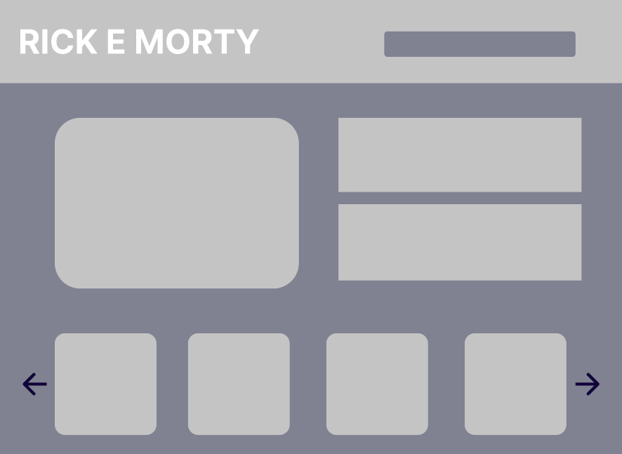
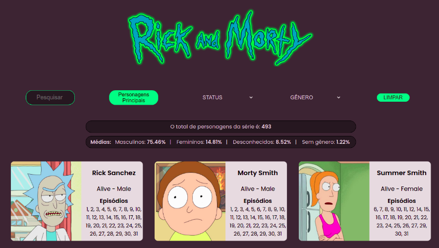

## Índice

- [Sobre](#Data-Lovers---Rick-e-Morty)
- [Resumo do projeto](#Projeto)
- [Definição de produto](#Definição-de-produto)
- [Layout](#Layout)
- [Histórias de usuário](#Histórias-de-usuário)
- [Testes de usabilidade](#Testes-de-usabilidade)
- [Tecnologias utilizadas](#Tecnologias)

---

# Data Lovers - Rick e Morty

[Rick and Morty](https://pt.wikipedia.org/wiki/Rick_and_Morty) é uma série de animação adulta norte-americana de comédia e ficção científica criada por Justin Roiland e Dan Harmon para o bloco de programação noturno Adult Swim, exibido no canal Cartoon Network.

É uma das animações mais insanas e viciantes produzidas até hoje. Criado inicialmente como uma paródia de De Volta para o Futuro, as aventuras do cientista gênio egoísta Rick e seu neto mais incapaz de pensar que uma porta Morty, conquistou diversos fãs ao redor do mundo.

Rick é um cientista brilhante e está sempre em busca de grandes experiências, indo parar até em universos paralelos. Ele é bem esquentado e sempre sobra para seu neto, Morty, que o acompanha nessas expedições.

## Projeto

Data Lovers é um guia para os fãs dessa instigante animação, com ele é possível encontrar os personagens da série e filtrá-los de acordo com status e gênero, para que o usuário descubra os episódios em que ele(a) aparecem e possa escolher um para assistir. Também é possível pesquisar por nome e ordenar por número de episódios.

Aplicação web desenvolvida durante o bootcamp da Laboratória.

## Definição de produto

A aplicação foi desenvolvida para que o usuário possa navegar no site de forma simples e prática, dando destaque aos cards dos personagens e as informações mais relevantes que o usuário deseja encontrar.
A série possui muitos personagens, com diferentes características e assim, buscamos facilitar ao usuário encontrá-los, utilizando opções de filtros, como status e gênero.
Dessa forma, facilitaria a escolha do episódio à assistir e a visualização das informações.

## Layout

O processo de criação foi pensado buscando um layout intuitivo e de fácil compreensão, que mostrasse apenas as informações principais, como imagem/especificações dos personagens, opções de filtro e estatísticas.

Durante o processo, modificamos o design original, removendo o slider maior, pois não tinha uma função definida e o slide com apenas quatro personagens, para que pudessemos printar todos os cards na tela e não somente alguns.

Protótipo de baixa fidelidade:

Protótipo de alta fidelidade:

Versão final

## Histórias de usuário

Backlog: O usuário está assistindo a série e gostaria de saber mais sobre os personagens, em qual episódio o personagem aparece, para escolher um ep. para assistir.

##### Critérios de aceitação:

- [x] O usuário consegue filtrar por status e gênero
- [x] O usuário consegue ordenar para ver os personagens mais frequentes na série
- [x] Ver os personagens em cards
- [x] O usuário pode pesquisar personagens por nome e ver os cards com as informações do personagem.
- [x] O usuário consegue ver uma curiosidade com o total dos personagens e a média de gênero.

##### Definição de pronto:

- [x] Passar nos testes
- [x] Padrão de código: ";" ao final da linha de código e aspas duplas.
- [x] Sem comentários
- [x] Subir pro github
- [x] Sem conflitos/bugs

História 1: O usuário quer ver impresso na tela, a imagem e informações do personagem com filtro.

##### Critérios de aceitação:

- [x] O usuário conseguirá ver o card do personagem na tela com a imagem e informações dele

História 2: O usuário quer ordenar os personagens por número de episódios para encontrar os mais relevantes

##### Critérios de aceitação:

- [x] O usuário conseguirá ordenar os personagens por relevância (que aparecem em mais episódios)
- [x] Testes feitos para a função filtrar e para ordenar.

História 3: O usuário poderá pesquisar os personagens pelo nome.

##### Critérios de aceitação:

- [x] O usuário pode pesquisar personagens por nome e ver os cards com as informações do personagem.

## Testes de usabilidade:

De acordo com os resultados dos testes de usabilidade, tiramos o botão de filtrar e, agora, o conteúdo é filtrado assim que o usuário clica na opção desejada de filtro.
E também diferenciamos os seletores de filtro dos outros botões a fim de deixar a experiência do usuário mais intuitiva.
Por fim, mudamos o idioma das opções de select para português.

## Tecnologias

- Javascript
- CSS3
- HTML5
- Json
- Jest
